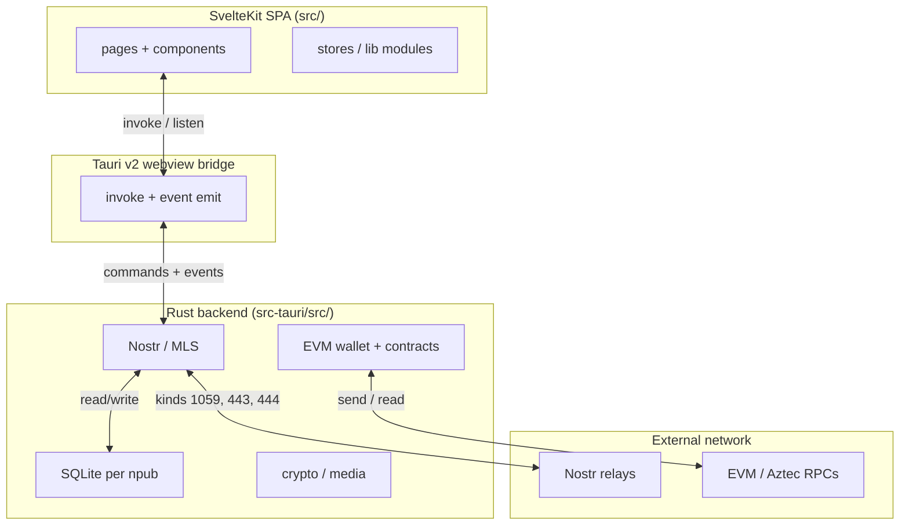
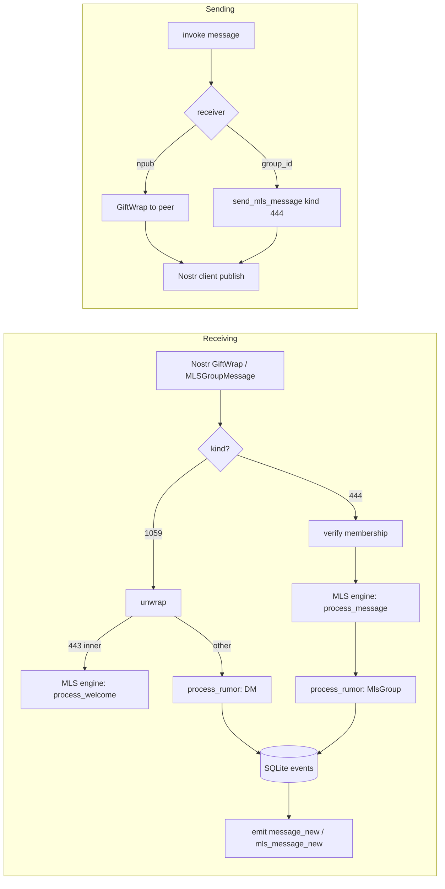
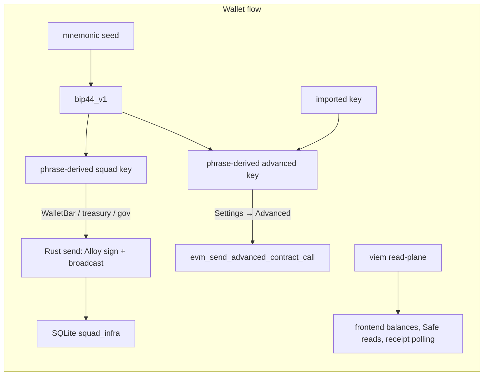
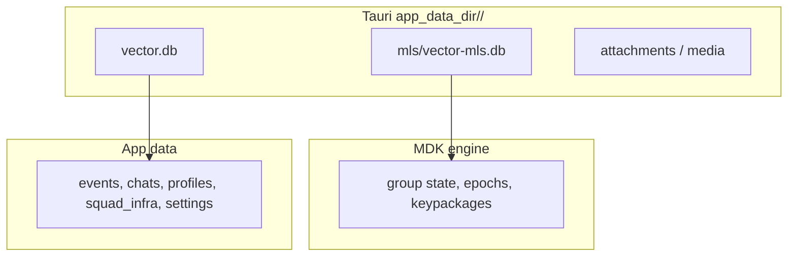

# Pacto Architecture

High-level view of how Pacto is built and how data flows. For deeper per-area docs, see `docs/README.md`.

## System overview

Pacto is a **Tauri v2 desktop application**: a **SvelteKit/Svelte** frontend (static SPA) backed by a **Rust** crate.

## Layer responsibilities

| Layer | Role | Key files |
|-------|------|-----------|
| **Frontend** | UI, state, user flows | `src/routes/+page.svelte`, `src/stores/`, `src/components/`, `src/lib/` |
| **Tauri bridge** | Typed frontend ⇄ backend RPC and events | `src-tauri/src/lib.rs` (`invoke_handler` + `AppHandle::emit`) |
| **Rust backend** | Crypto, Nostr/MLS relay logic, EVM signing, SQLite, media | `src-tauri/src/lib.rs`, `src-tauri/src/{nostr,mls,chat,message,rumor,db,account_manager,evm}/` |
| **Network** | Nostr relays for messaging; RPCs for chain reads and sends | `TRUSTED_RELAYS`, `ALCHEMY_RPC_KEY`, user RPC prefs |

## Data flows

### 1. Messaging

Nostr events flow in two parallel paths depending on the conversation type.

- **DMs** use NIP-59 Gift Wraps (kind 1059). The inner rumor uses kinds 14 (text), 15 (file), 7 (reaction), 30078 (typing), etc.
- **MLS groups** use kind 444 on the wire; kind 443 welcomes arrive inside a Gift Wrap.
- Both DM and MLS decrypted messages land in the same unified `Chat` / `Message` model in SQLite.

### 2. EVM wallet

Key derivation, reads, and writes are split across layers on purpose.

- The same BIP-39 seed derives both Nostr keys and EVM addresses.
- **Reads** (balances, contract observation, receipt polling) happen in the frontend via viem.
- **Writes** (WalletBar sends, treasury deployments, governance transactions) happen in Rust using Alloy.
- Signer purpose matters: `squad` keys can act on treasury and governance; `advanced` keys are restricted to the Advanced panel.

### 3. Storage

Each account is isolated under its npub.

- `vector-mls.db` is owned by the MDK engine; do not edit it by hand.
- `vector.db` holds chat metadata, Nostr-shaped events, profiles, and squad infrastructure pointers.
- Frontend state is npub-scoped via `localStorage` keys built with `persistenceKey(prefix)`.

## Key directories

| Directory | Purpose |
|-----------|---------|
| `src/` | Svelte frontend source |
| `src/routes/` | Single-page static SPA shell |
| `src/stores/` | Svelte writable/derived stores |
| `src/lib/` | Typed Tauri wrappers, domain logic, helpers |
| `src/components/` | Svelte UI components grouped by domain |
| `src-tauri/src/` | Rust backend crate |
| `src-tauri/src/evm/` | Wallet, key derivation, RPC, contract bindings, governance |
| `src-tauri/src/evm/contracts/` | `alloy::sol!` bindings for pacto-gov, sponsor, Safe, ERC-20, Hats |
| `static/` | Static assets (twemoji SVGs, etc.) |
| `docs/` | Authoritative tracked architecture and operational docs |
| `.cursor/rules/` | Editor-enforced project policies |
| `.github/workflows/` | Cross-platform release CI |

## Frontend architecture

- `src/routes/+page.svelte` is the single root container.
- `src/lib/app/tauri-subscriptions.ts` is the central bridge for backend → UI events (`message_new`, `mls_message_new`, `profile_update`, etc.).
- `src/stores/app.ts` is a thin re-export barrel; new code should import directly from domain slices (`auth.ts`, `dm.ts`, `squads.ts`, `mls-chat.ts`, etc.).
- State persistence is npub-scoped. Use `persistenceKey(prefix)` from `src/stores/persistence-context.ts` for any new `localStorage` key.

## Backend architecture

- `src-tauri/src/main.rs` calls `pacto_lib::run()`.
- `src-tauri/src/lib.rs` bootstraps the Tauri app, holds global mutable state (`STATE`, `NOSTR_CLIENT`, `MNEMONIC_SEED`, `TAURI_APP`, `ENCRYPTION_KEY`), and registers the `invoke_handler`.
- `src-tauri/src/rumor.rs` is the protocol-agnostic processor: DM and MLS decrypted events produce `RumorProcessingResult` and are stored as flat `StoredEvent` rows.
- `src-tauri/src/db.rs` implements most `#[tauri::command]` database entry points using pooled connections from `account_manager.rs`.
- `src-tauri/src/evm/mod.rs` is the EVM module root; `evm/rpc/` handles providers, signers, and structured errors.

## Security and trust model

- No KYC; identity is cryptographic (npub / nsec).
- The EVM private key is decrypted in Rust only for approved operations and is not exposed to the frontend.
- Message content and secrets are stored encrypted; profile and indexing metadata is plaintext for search and performance.
- There is no independent third-party security audit yet. See `docs/audits/README.md`.

## Cross-cutting conventions

- **Greenfield:** no public alpha shipped yet; prefer breaking, minimal paths over legacy compatibility shims.
- **Brief inline comments:** explain behavior, not architecture. Point to `docs/` for details.
- **No tracker IDs, spec section markers, or checklist breadcrumbs in source.**
- **Public protocol addresses** belong in tracked JSON (`src/lib/evm/pacto-protocol-addresses.json`), not `.env`.

## Related docs

- `docs/README.md` — docs index
- `docs/messaging/OVERVIEW.md` — DM vs MLS in detail
- `docs/nostr/ARCHITECTURE.md` — Nostr kinds and subscriptions
- `docs/mls/ARCHITECTURE.md` — MLS engine and storage split
- `docs/communities/DESIGN.md` — squads, networks, and stable ids
- `docs/wallet/README.md` — embedded EVM wallet
- `docs/storage-layout/SQLITE_AND_FILES.md` — per-account SQLite layout
- `STRATEGY.md` — product strategy
- `CONCEPTS.md` — shared vocabulary
