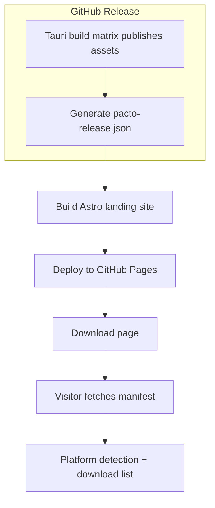

# Download Site Integration — Requirements

## Summary

A self-contained Astro marketing site in `landing/` hosts a public download page. The first version consumes a generated `pacto-release.json` manifest and deploys to GitHub Pages when a release is published. The download page is independent of the SvelteKit app and its auth layout. The stale Tauri updater endpoint is corrected to match the current `pacto-app` release source.

## Problem Frame

Pacto currently maintains a separate `pacto-download` repository with a hardcoded `config.js` (`releaseTag: "v0.1.0"`, fixed file list). Every release requires a manual update to that repo. The site also duplicates branding assets that now live in `pacto-app`. Meanwhile, `src-tauri/tauri.conf.json` still points the updater at the old `covenant-gov/covenant-application` repo name. Bringing the download page into `pacto-app` and driving it from the release workflow eliminates the manual step and keeps the updater and download surface on the same source of truth.

## Key Decisions

- **Astro, self-contained in `landing/`**: Chosen over a SvelteKit route or static HTML file to keep marketing surfaces independent of the auth-gated app and make future marketing pages cheap.
- **Custom `pacto-release.json` manifest**: Chosen over reusing the Tauri updater `latest.json` to support human-friendly platform labels and file-size metadata.
- **Deploy on `release:published`**: Chosen over a tag-push trigger so the site rebuilds only after the release and its assets are actually published.
- **Fresh visual design**: Final design is produced during implementation via the brandkit skill; only `logo.png` and favicon assets migrate from `pacto-download` as placeholders.
- **Update stale updater endpoint**: The Tauri updater endpoint in `src-tauri/tauri.conf.json` is corrected from `covenant-gov/covenant-application` to `covenant-gov/pacto-app` so the updater and download page share one release source.

## Requirements

### Landing site structure

- R1. A self-contained Astro site lives in `landing/` at the repo root.
- R2. The site is independent of the SvelteKit app and is not gated by `src/routes/+layout.svelte`.
- R3. v1 ships a single public page: the download page.
- R4. The download page lists all platform installers for the current release.
- R5. The download page highlights the installer matching the visitor's platform.
- R6. The download page falls back to a GitHub releases link when no matching asset exists.

### Manifest and release data

- R7. A `pacto-release.json` manifest is generated per release.
- R8. The manifest is derived from the actual assets published to the GitHub release.
- R9. The manifest includes platform, friendly label, asset URL, and file size for each installer.
- R10. The manifest is generated after the Tauri build matrix publishes assets.

### Deployment and automation

- R11. The landing site is rebuilt and deployed to GitHub Pages on `release:published`.
- R12. The site can also be redeployed manually from a workflow dispatch.
- R13. The public download destination is the GitHub Pages URL for `pacto-app`.

### Consistency fixes

- R14. The Tauri updater endpoint in `src-tauri/tauri.conf.json` points to `covenant-gov/pacto-app`.
- R15. The `pacto-download` repository is no longer the source of truth for downloads.

## Key Flows

### F1. Release published

- **Trigger:** The GitHub release for `covenant-gov/pacto-app` changes to published.
- **Actors:** Release workflow, GitHub Releases, GitHub Pages.
- **Steps:** The workflow reads the published release assets; generates `pacto-release.json`; builds the Astro site; deploys the static output to GitHub Pages.
- **Outcome:** The public download page reflects the new release.

### F2. Visitor downloads Pacto

- **Trigger:** A visitor opens the landing site.
- **Actors:** Visitor, landing site.
- **Steps:** The site loads; fetches `pacto-release.json`; detects the visitor's platform; renders the primary download button and an expandable list of all installers.
- **Outcome:** The visitor downloads the correct installer or sees all available options.

## Scope Boundaries

- **Deferred for later:** multi-page marketing site (features, screenshots, FAQ), package-manager distribution, in-app update prompts.
- **Outside this product's identity:** using a separate, manually maintained download repository; storing installer binaries in git; reusing the Tauri `latest.json` as the human-facing download data source.

## Dependencies / Assumptions

- GitHub Pages is enabled and configured for workflow-based deployment on `covenant-gov/pacto-app`.
- The Tauri release workflow continues to publish assets to the `pacto-app` GitHub release.
- The `pacto-download` logo and favicon assets are available to copy into `landing/`.

## Sources / Research

- `pacto-download` repository: existing download page, `config.js`, `index.html`, `script.js`, `styles.css`.
- `src/routes/+layout.svelte` — auth gate.
- `svelte.config.js` — static adapter configuration.
- `.github/workflows/release.yaml` — release pipeline.
- `src-tauri/tauri.conf.json` — updater endpoint configuration.
