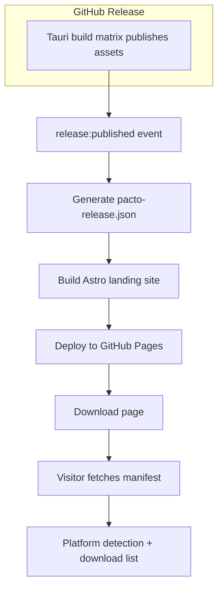

# Download Site Landing Page

## Summary

Add a self-contained Astro landing site in `landing/` that hosts a public download page. The page is rebuilt on every published GitHub release and deployed to GitHub Pages. A release workflow generates `pacto-release.json` from the actual Tauri assets, and the download page consumes it at runtime. The stale Tauri updater endpoint in `src-tauri/tauri.conf.json` is also corrected to point to `covenant-gov/pacto-app`.

## Problem Frame

Pacto currently ships downloads from a separate `pacto-download` repository with a hardcoded `config.js` (`releaseTag: "v0.1.0"`, fixed file list). Each release requires a manual edit there. The updater endpoint in `src-tauri/tauri.conf.json` still references the old repo name. This plan collapses the download surface into `pacto-app` and drives it from the same release event that publishes the installers.

## Requirements

### Landing site structure

- R1. A self-contained Astro site lives in `landing/` at the repo root.
- R2. The site is independent of the SvelteKit app and is not gated by `src/routes/+layout.svelte`.
- R3. v1 ships a single public page: the download page.
- R4. The download page lists all platform installers for the current release.
- R5. The download page highlights the installer matching the visitor's platform.
- R6. The download page falls back to a GitHub releases link when no matching asset exists.

### Manifest and release data

- R7. A `pacto-release.json` manifest is generated per release.
- R8. The manifest is derived from the actual assets published to the GitHub release.
- R9. The manifest includes platform, friendly label, asset URL, and file size for each installer.
- R10. The manifest is generated after the Tauri build matrix publishes assets.

### Deployment and automation

- R11. The landing site is rebuilt and deployed to GitHub Pages on `release:published`.
- R12. The site can also be redeployed manually from a workflow dispatch.
- R13. The public download destination is the GitHub Pages URL for `pacto-app`.

### Consistency fixes

- R14. The Tauri updater endpoint in `src-tauri/tauri.conf.json` points to `covenant-gov/pacto-app`.
- R15. The `pacto-download` repository is no longer the source of truth for downloads.

## Key Technical Decisions

- **Astro in `landing/` with static output**: Keeps marketing surfaces independent of the auth-gated SvelteKit app and makes future marketing pages cheap. (see origin: R1–R3)
- **Separate `release:published` workflow**: The existing tag-push workflow publishes a draft release; the site should deploy only when that release is actually published. (see origin: R10, R11)
- **Manifest generated at build time from GitHub release assets**: Guarantees the download page matches the actual published installers and eliminates hardcoded filenames. (see origin: R7–R9)
- **Manifest fetched at runtime by the download page**: Allows the same static build to be redeployed with a new manifest without rebuilding client code, and supports manual `workflow_dispatch` redeploys. (see origin: F2)
- **GitHub Pages with project-page base path `/pacto-app`**: The repo is `pacto-app` under `covenant-gov`, so the default Pages URL is `covenant-gov.github.io/pacto-app`. (see origin: R13)
- **Fix stale updater endpoint in the same change**: The updater and download surface must share the same release source. (see origin: R14)

---

## High-Level Technical Design



The landing site is a separate static Astro project at `landing/`. Its `public/` directory receives the generated `pacto-release.json` before build. The download page is a static shell that fetches the manifest and renders platform cards client-side. The deployment workflow is triggered by the `release:published` event and uses the GitHub Pages deployment action pair.

---

## Output Structure

```text
landing/
├── astro.config.mjs
├── package.json
├── pnpm-lock.yaml
├── public/
│   ├── favicon.ico
│   ├── favicon-*.png
│   ├── logo.png
│   └── pacto-release.json     # generated at build time
├── src/
│   ├── components/
│   │   └── DownloadPage.astro
│   ├── scripts/
│   │   └── platform.ts
│   └── pages/
│       └── index.astro
scripts/
└── generate-release-manifest.mjs  # manifest generator
.github/workflows/
├── ci.yaml                      # adds landing build job
├── deploy-landing.yaml          # new release:published workflow
└── release.yaml                 # unchanged Tauri release workflow
```

## Implementation Units

### U1. Scaffold the Astro landing site

- **Goal:** Create the `landing/` Astro project with static output, its own package manifest, and a minimal download page shell.
- **Requirements:** R1, R2, R3
- **Dependencies:** None
- **Files:** `landing/astro.config.mjs`, `landing/package.json`, `landing/pnpm-lock.yaml`, `landing/src/pages/index.astro`, `landing/public/logo.png`, `landing/public/favicon.ico`
- **Approach:** Initialize a self-contained Astro project with `output: 'static'`. Configure `site` to the Pages URL and `base` to `/pacto-app`. Copy only the logo and favicon placeholders from `pacto-download`; the final visual design is produced via the brandkit skill.
- **Patterns to follow:** Keep landing tooling independent of the root SvelteKit/Tauri app; use pnpm and Node LTS to match the repo.
- **Test scenarios:**
  - `pnpm install` in `landing/` succeeds.
  - `pnpm build` in `landing/` produces static output in `landing/dist/`.
  - The built `index.html` loads without redirecting to the SvelteKit auth layout.
- **Verification:** The Astro build passes and the dist folder contains the expected static files.

### U2. Build the download page

- **Goal:** Implement the download page that fetches the manifest, detects the visitor's platform, and renders the primary download plus the full installer list.
- **Requirements:** R4, R5, R6
- **Dependencies:** U1
- **Files:** `landing/src/pages/index.astro`, `landing/src/components/DownloadPage.astro`, `landing/src/scripts/platform.ts`
- **Approach:** Use client-side JavaScript to fetch `/pacto-app/pacto-release.json` (or relative path). Parse the user agent to determine the platform, highlight the matching asset, and provide an expandable list of all assets. Fall back to the GitHub release page when no asset matches.
- **Patterns to follow:** Mirror the old `pacto-download` behavior: primary button for detected OS, "Show All Downloads" toggle, platform labels, and signature links when available.
- **Test scenarios:**
  - macOS user agent highlights the macOS DMG.
  - Windows user agent highlights the Windows installer.
  - Linux user agent highlights the Linux AppImage.
  - Missing platform shows the fallback releases link.
  - Failed manifest fetch shows a sensible error state.
- **Verification:** Manual QA with user-agent spoofing confirms the correct asset is highlighted and the list renders.

### U3. Create the manifest generation script

- **Goal:** Generate `pacto-release.json` from the actual GitHub release assets.
- **Requirements:** R7, R8, R9, R10
- **Dependencies:** None (runs after release assets are published)
- **Files:** `scripts/generate-release-manifest.mjs`, `scripts/generate-release-manifest.test.mjs`, `landing/public/pacto-release.json`
- **Approach:** Write a Node script that uses the GitHub CLI (`gh release view`) or GitHub REST API to list assets for the release tag. Map asset filenames to platform/arch/label entries (e.g., `.msi` and `.exe` → Windows x64, `.dmg` with `aarch64` or `arm64` → macOS Apple Silicon, `.AppImage` → Linux x64, etc.). Exclude non-installer artifacts like `.sig` and `latest.json`. Write the JSON to `landing/public/pacto-release.json`.
- **Patterns to follow:** Keep the mapping table explicit and easy to extend; prefer the GitHub CLI when available in the workflow runner.
- **Test scenarios:**
  - The script maps every current Tauri asset to the correct platform and label.
  - Unit tests in `scripts/generate-release-manifest.test.mjs` cover the platform mapping and exclusion logic.
  - `.sig` files and `latest.json` are excluded from the installer list.
  - Each entry includes `name`, `platform`, `arch`, `label`, `url`, and `size`.
  - The script fails with a clear message if the release has no assets.
- **Verification:** Run the script against a published release and inspect the generated JSON.

### U4. Add the landing deployment workflow

- **Goal:** Deploy the landing site to GitHub Pages when a release is published.
- **Requirements:** R11, R12, R13
- **Dependencies:** U1, U3
- **Files:** `.github/workflows/deploy-landing.yaml`
- **Approach:** Trigger on `release: published` and `workflow_dispatch`. In the build job, check out the repo, run the manifest generation script, then call `withastro/action@v6` with `path: landing`. In a separate deploy job that `needs: build`, run `actions/deploy-pages@v5` with the required `pages: write` and `id-token: write` permissions and `environment: github-pages`.
- **Patterns to follow:** Use the same action versions and pnpm/Node pinning as `.github/workflows/release.yaml` and `.github/workflows/ci.yaml`.
- **Test scenarios:**
  - The workflow triggers on `release:published`.
  - The `workflow_dispatch` trigger runs the build and deploy jobs manually.
  - The build job generates `landing/public/pacto-release.json` before Astro build.
  - The deploy job succeeds only when the build job passes.
- **Verification:** Publish a test release and confirm the Pages deployment completes and the download page reflects the new manifest.

### U5. Fix the Tauri updater endpoint

- **Goal:** Correct the updater endpoint in `src-tauri/tauri.conf.json` to point to `covenant-gov/pacto-app`.
- **Requirements:** R14, R15
- **Dependencies:** None
- **Files:** `src-tauri/tauri.conf.json`
- **Approach:** Update the `plugins.updater.endpoints` URL from `https://github.com/covenant-gov/covenant-application/releases/latest/download/latest.json` to `https://github.com/covenant-gov/pacto-app/releases/latest/download/latest.json`.
- **Test scenarios:**
  - The updater URL matches the repo where releases are published.
- **Verification:** The Tauri config is valid and the updater endpoint is the expected `pacto-app` URL.

### U6. Add CI checks for the landing site

- **Goal:** Prevent the landing site from breaking silently in PRs.
- **Requirements:** (implicit quality gate)
- **Dependencies:** U1
- **Files:** `.github/workflows/ci.yaml`
- **Approach:** Add a `landing-build` job that checks out the repo, installs dependencies in `landing/`, and runs `pnpm build`.
- **Patterns to follow:** Match existing CI jobs: `actions/checkout@v6`, `actions/setup-node@v6.4.0`, `pnpm/action-setup@v6` with version `11.7.0`.
- **Test scenarios:**
  - A PR that breaks the Astro build fails the `landing-build` job.
  - A PR that only touches the SvelteKit app still passes the `landing-build` job.
- **Verification:** The CI job passes on `main` and on PRs that touch `landing/`.

---

## Scope Boundaries

- **Deferred for later:** multi-page marketing site (features, screenshots, FAQ), package-manager distribution, in-app update prompts, automated brandkit-driven design refresh after v1.
- **Outside this product's identity:** maintaining a separate `pacto-download` repository, storing installer binaries in git, reusing the Tauri `latest.json` as the human-facing download data source.

## Risks & Dependencies

| Risk | Mitigation |
|---|---|
| GitHub Pages not enabled or set to GitHub Actions source | Verify repo settings before first deployment; document the requirement. |
| Tauri asset filenames change and break platform mapping | Keep the mapping table explicit and centralized in the manifest script; add a test run as part of U3 verification. |
| Draft releases are never published, so `release:published` never fires | The existing workflow already publishes draft releases; the deployment workflow works the same whether the draft is auto-published or manual. |
| `workflow_dispatch` redeploys an old manifest | The manifest script always reads the latest release, so manual redeploys reflect the current release. |
| brandkit skill not available in active skill set | Implementation note: load the brandkit skill when the design phase begins; fallback to the placeholder logo/favicon if design is deferred. |

---

## Open Questions

- **Pre-releases on the public download page:** Should pre-releases update the public download page, or only stable releases? Default: include pre-releases; add a filter later if needed.
- **Custom domain:** Will `pacto-app` use a custom domain for GitHub Pages? Default: use the project-page URL (`covenant-gov.github.io/pacto-app`) with `base: '/pacto-app'`.

---

## Sources / Research

- `docs/brainstorms/2026-07-11-download-site-integration-requirements.md` — origin requirements and key decisions.
- `.github/workflows/release.yaml` — existing Tauri release pipeline.
- `.github/workflows/ci.yaml` — existing CI gates.
- `src-tauri/tauri.conf.json` — stale updater endpoint and Tauri configuration.
- `svelte.config.js` — SvelteKit static adapter configuration.
- `src/routes/+layout.svelte` — auth gate that the landing site must bypass.
- `pacto-download` repository — existing download page, `config.js`, `script.js`, `styles.css`, and branding assets.
- Astro 7 static site documentation, GitHub Actions Pages deployment (`actions/deploy-pages@v5`, `withastro/action@v6`), and GitHub Releases API best practices.
